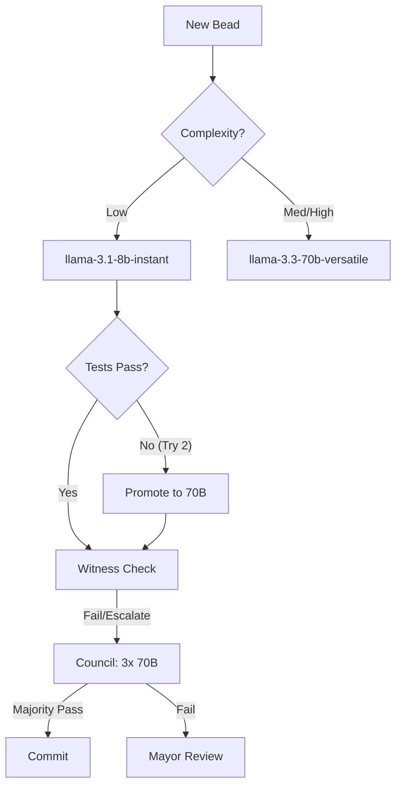

# NOS Town Routing — Intelligence & Cost Optimized

Model routing strategies and escalation patterns for the NOS Town multi-agent system.

---

## Overview

NOS Town employs a dynamic, data-driven routing architecture. Instead of a single frontier model, tasks are routed through an escalation ladder designed to minimize cost while maximizing output quality. The routing table is continuously refined by the **Historian** based on empirical Bead success rates.

---

## Routing Principles

1. **Efficiency First:** Default all non-critical Beads to Tier B (8B). Use Tier A (70B/120B) only when logic complexity warrants it.
2. **Deterministic Escalation:** If an 8B model fails a task's internal unit tests twice, it is automatically promoted to 70B with the failed context attached.
3. **Consensus for Criticality:** "High-Risk" tasks (Security, DB Schema, Core Auth) require a 3-judge Witness Council regardless of model performance.
4. **Batch for Analysis:** Latency-insensitive tasks (Documentation, Log Analysis, Playbook Mining) must use Groq Batch API for 50% cost savings.

---

## Routing Table (v1.2)

| Bead Category | Complexity | Default Model | Safeguard | Witness |
|---------------|------------|---------------|-----------|---------|
| **Boilerplate** | Low | llama-3.1-8b-instant | No | No |
| **Business Logic**| Medium | llama-3.3-70b-versatile | Yes | Yes |
| **Security/Auth** | High | llama-3.3-70b-versatile | Yes | **Council** |
| **Architecture** | Critical | gpt-oss-120b | Yes | **Council** |
| **Unit Tests** | Low | llama-3.1-8b-instant | No | Yes |
| **Refactoring** | Medium | llama-3.3-70b-versatile | Yes | Yes |
| **Documentation** | Low | Batch (llama-3.1-8b) | No | No |

---

## The Escalation Ladder

NOS Town's "Fail-Promote" loop ensures quality without overspending on simple tasks.



---

## Witness Council Protocol

When a single Witness confidence score falls between **60–79**, or for any **High-Risk** Bead, a Council is summoned.

### Council Configuration:
- **Judges:** 3x `llama-3.3-70b-versatile` running in parallel.
- **Aggregation:** Majority verdict (2/3 or 3/3).
- **Latency:** < 5 seconds total (at Groq speed).

### Evaluation Metric:
docs: Enhance ROUTING.md with escalation ladder and cost-to-quality matrix{
docs: Enhance ROUTING.md with escalation ladder and cost-to-quality matrix  "judges": ["judge_1", "judge_2", "judge_3"],
  "decision_logic": "weighted_average_score"
}
```

---

## A/B Routing Config

To maintain frontier quality, 10% of traffic is routed to experimental models.

```yaml
# routing/ab_test.yaml
ab_tests:
  active: true
  experiment:
    model: "llama-3.4-70b-preview"
    weight: 0.10
  baseline:
    model: "llama-3.3-70b-versatile"
    weight: 0.90
  success_criteria:
    - witness_pass_rate > 0.95
    - avg_witness_score > 88
    - p95_latency < 1500ms
```

---

## Cost-to-Quality Matrix

Optimizing for the "Efficiency Frontier":

| Tier | Model | Input (1M) | Output (1M) | Best Quality/Cost Tradeoff |
|------|-------|------------|-------------|----------------------------|
| **B** | 8B | $0.05 | $0.08 | Repetitive boilerplate, unit tests |
| **A** | 70B | $0.59 | $0.79 | Synthesis, logical reasoning |
| **S** | 120B | $0.90 | $1.20 | Final review, complex refactors |
| **Batch** | Any | -50% | -50% | Historian, background formatting |
