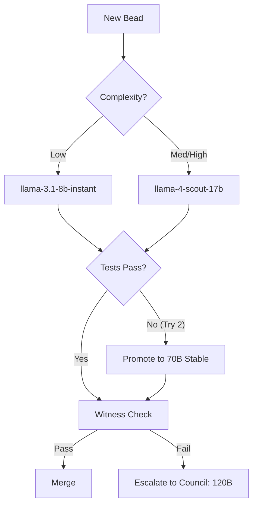

# NOS Town Routing - Intelligence & Cost Optimized

Model routing strategies and escalation patterns for the NOS Town multi-agent system, featuring the Preview-Primary escalation protocol.

---

## Overview

NOS Town employs a dynamic, data-driven routing architecture. Instead of a single frontier model, tasks are routed through an escalation ladder designed to minimize cost while maximizing output quality. The routing table is continuously refined by the **Historian** based on empirical Bead success rates.

---

## Preview-Primary Escalation

To leverage high-performance preview models safely, NOS Town implements a "Stabilized Escalation" pattern:
1. **Target Preview:** Attempt the task with the high-speed/high-capability Preview model first (e.g., Llama 4 Scout).
2. **Deterministic Validation:** Run unit tests and a Safeguard scan.
3. **Automatic Fallback:** If validation fails or the Preview API returns a 503/429, the system automatically hot-swaps to the Stable Fallback model (e.g., Llama 3.3 70B) for the retry.

---

## Routing Table (v2.0)

| Bead Category | Complexity | Primary Model (Preview) | Stable Fallback | Safeguard | Witness |
| :--- | :--- | :--- | :--- | :--- | :--- |
| **Boilerplate** | Low | `llama-3.1-8b-instant` | N/A | No | No |
| **Logic/Feature** | Medium | `llama-4-scout-17b` | `llama-3.1-8b-instant` | Yes | Yes |
| **Security/Auth** | High | `qwen3-32b` | `llama-3.3-70b-versatile` | Yes | **Council** |
| **Architecture** | Critical | `gpt-oss-120b` | `llama-3.3-70b-versatile` | Yes | **Council** |
| **Unit Tests** | Low | `llama-3.1-8b-instant` | N/A | No | Yes |
| **Refactoring** | Medium | `llama-4-scout-17b` | `llama-3.1-8b-instant` | Yes | Yes |
| **Documentation** | Low | `Batch (llama-3.1-8b)` | N/A | No | No |

---

## The Escalation Ladder

NOS Town's "Fail-Promote" loop ensures quality without overspending on simple tasks.

