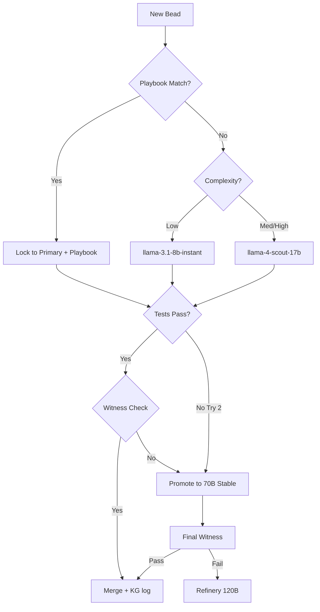

# NOS Town Routing - Intelligence & Cost Optimized

Model routing strategies and escalation patterns for the NOS Town multi-agent system, featuring the Preview-Primary escalation protocol and palace-aware Playbook routing.

---

## Overview

NOS Town employs a dynamic, data-driven routing architecture. Instead of a single frontier model, tasks are routed through an escalation ladder designed to minimize cost while maximizing output quality. The routing table is continuously refined by the **Historian** based on empirical Bead success rates — now stored as temporal KG triples in MemPalace rather than a static markdown file.

---

## Preview-Primary Escalation

To leverage high-performance preview models safely, NOS Town implements a "Stabilized Escalation" pattern:

1. **Playbook Check (New):** Before any model is selected, Mayor queries `mempalace_search "{task}" --wing wing_rig_{project} --hall hall_advice`. If a Playbook match exists with >90% historical success rate, the Polecat is given the Playbook and routed directly to the Primary model without escalation.
2. **Target Preview:** Attempt the task with the high-speed/high-capability Preview model first (e.g., Llama 4 Scout).
3. **Deterministic Validation:** Run unit tests and a Safeguard scan.
4. **Automatic Fallback:** If validation fails or the Preview API returns a 503/429, the system automatically hot-swaps to the Stable Fallback model (e.g., Llama 3.3 70B) for the retry.

---

## Routing Table (v3.0 — Palace-Aware)

Added **Playbook Hall** column: the `hall_advice` room to search before model selection. A Playbook hit at this stage short-circuits escalation and locks the task to the Primary model with the Golden Path.

| Bead Category | Complexity | Primary Model (Preview) | Stable Fallback | Safeguard | Witness | Playbook Hall |
|---|---|---|---|---|---|---|
| **Boilerplate** | Low | `llama-3.1-8b-instant` | N/A | No | No | `hall_advice/boilerplate` |
| **Logic/Feature** | Medium | `llama-4-scout-17b` | `llama-3.1-8b-instant` | Yes | Yes | `hall_advice/logic-feature` |
| **Security/Auth** | High | `qwen3-32b` | `llama-3.3-70b-versatile` | Yes | **Council** | `hall_advice/security-auth` |
| **Architecture** | Critical | `gpt-oss-120b` | `llama-3.3-70b-versatile` | Yes | **Council** | `hall_advice/architecture` |
| **Unit Tests** | Low | `llama-3.1-8b-instant` | N/A | No | Yes | `hall_advice/unit-tests` |
| **Refactoring** | Medium | `llama-4-scout-17b` | `llama-3.1-8b-instant` | Yes | Yes | `hall_advice/refactoring` |
| **Documentation** | Low | `Batch (llama-3.1-8b)` | N/A | No | No | `hall_advice/documentation` |

---

## The Escalation Ladder

NOS Town's "Fail-Promote" loop ensures quality without overspending on simple tasks. With MemPalace, a Playbook hit short-circuits the loop entirely:



---

## KG-Backed Routing Evolution

Model routing locks and demotions are now tracked as temporal KG triples by the Historian, replacing the static routing table markdown update cycle. The Mayor can query live routing state at any time:

```python
# Query current effective routing for a task cluster:
kg.query_entity("llama-3.1-8b", as_of=today)
# → [{"locked_to": "typescript_generics", "valid_from": "2026-04-01", "active": true}]

# Query what routing was in effect last month:
kg.query_entity("llama-4-scout-17b", as_of="2026-03-01")
```

This means:
- **No more manual routing table edits** — Historian writes to KG nightly
- **Mayor has live routing state** — always reads the current active triples
- **Full audit trail** — every routing change has a timestamp and success rate

---

## Cross-Rig Routing Acceleration (Tunnels)

When a task room exists in multiple Rig wings (e.g., `auth-migration` appears in both `wing_rig_tcgliveassist` and `wing_rig_openclaw`), a Tunnel is registered by the Historian. The Mayor can then query:

```bash
mempalace_find_tunnels(wing_rig_tcgliveassist, wing_rig_openclaw)
# → [{"tunnel": "auth-migration", "wings": ["wing_rig_tcgliveassist", "wing_rig_openclaw"]}]

# Cross-rig Playbook search:
mempalace_search "JWT auth refresh token" --tunnel auth-migration
# → Returns Playbooks from BOTH rigs, ranked by success rate
```

This means a proven solution from one project instantly benefits another — without any manual copy-paste.

---

## Routing Table Retention

- **Active routing locks** — KG triples with no `valid_to` date (current state)
- **Historical routing** — KG triples with `valid_from` and `valid_to` (full audit trail)
- **Playbooks** — permanent Drawers in `hall_advice`, never expire
- **Static v2.0 table above** — used as initial bootstrap config before KG has sufficient data

---

## See Also

- [MEMPALACE.md](./MEMPALACE.md) — KG schema, palace hierarchy, MCP tool reference
- [HISTORIAN.md](./HISTORIAN.md) — How the Historian writes routing promotions/demotions to the KG
- [ROLES.md](./ROLES.md) — Mayor Playbook lookup protocol before Bead decomposition
