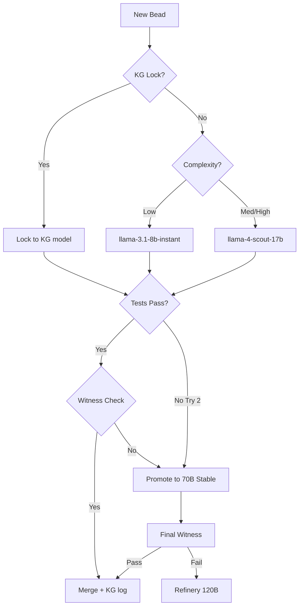

# NOS Town Routing - Intelligence & Cost Optimized

> Internal runway note: dynamic routing is a future internal runtime capability.
> It must not leak into the role-neutral Gas City bridge schema or require Gas
> City changes beyond `city.toml`.

Model routing strategies and escalation patterns for the NOS Town multi-agent system, featuring the Preview-Primary escalation protocol and KG-backed Playbook routing.

---

## Overview

NOS Town employs a dynamic, data-driven routing architecture. Instead of a single frontier model, tasks are routed through an escalation ladder designed to minimize cost while maximizing output quality. The routing table is continuously refined by the **Historian** based on empirical Bead success rates — stored as temporal KG triples in `kg/knowledge_graph.sqlite`.

---

## Preview-Primary Escalation

To leverage high-performance preview models safely, NOS Town implements a "Stabilized Escalation" pattern:

1. **KG Lock Check:** Before any model is selected, Mayor queries the KG for any `locked_to` triple matching the task type. If found with sufficient confidence, the bead is routed directly to that model.
2. **Target Preview:** Attempt the task with the high-speed/high-capability Preview model first (e.g., Llama 4 Scout).
3. **Deterministic Validation:** Run unit tests and a Safeguard scan.
4. **Automatic Fallback:** If validation fails or the Preview API returns a 503/429, the system automatically hot-swaps to the Stable Fallback model for the retry.

### Playbook Freshness Guard

Playbook short-circuiting is allowed only when all of the following are true:

- historical success rate > 90%
- sample size >= 20
- no active Safeguard lockdown pattern applies to the same task class

If freshness checks fail, the Playbook may still be attached as advisory context, but routing is not locked directly to the Primary model.

---

## Routing Table (v3.0 — KG-Aware)

| Bead Category | Complexity | Primary Model (Preview) | Stable Fallback | Safeguard | Witness |
|---|---|---|---|---|---|
| **Boilerplate** | Low | `llama-3.1-8b-instant` | N/A | No | No |
| **Logic/Feature** | Medium | `llama-4-scout-17b` | `llama-3.1-8b-instant` | Yes | Yes |
| **Security/Auth** | High | `qwen3-32b` | `llama-3.3-70b-versatile` | Yes | **Council** |
| **Architecture** | Critical | `gpt-oss-120b` | `llama-3.3-70b-versatile` | Yes | **Council** |
| **Unit Tests** | Low | `llama-3.1-8b-instant` | N/A | No | Yes |
| **Refactoring** | Medium | `llama-4-scout-17b` | `llama-3.1-8b-instant` | Yes | Yes |
| **Documentation** | Low | `Batch (llama-3.1-8b)` | N/A | No | No |

---

## The Escalation Ladder

NOS Town's "Fail-Promote" loop ensures quality without overspending on simple tasks. A KG routing lock short-circuits the loop entirely:



---

## KG-Backed Routing Evolution

Model routing locks and demotions are tracked as temporal KG triples by the Historian. The Mayor queries live routing state at dispatch time:

```typescript
// Query current effective routing for a task cluster:
kg.queryTriples('llama-3.1-8b', today);
// → [{ relation: 'locked_to', object: 'typescript_generics', valid_from: '2026-04-01' }]
```

This means:
- **No more manual routing table edits** — Historian writes to KG nightly
- **Mayor has live routing state** — always reads the current active triples
- **Full audit trail** — every routing change has a timestamp and success rate

---

## Cross-Rig Tunnel Safety Guard

Cross-rig knowledge sharing is enabled via the Tunnel Safety Guard (`src/routing/dispatch.ts`). Before using results from another rig, the Mayor verifies:

- same task room name
- compatible stack or framework family
- no explicit isolation flag on either rig
- tunnel result freshness within the configured lookback window (default: 14 days)

Tunnel hits that fail safety checks are logged as advisory-only, not auto-applied.

```typescript
const result = checkTunnelSafety(roomName, tunnelContext, options);
// result.safe === false → advisory only, do not auto-apply
// result.safe === true  → proceed with tunnel result
```

---

## Routing Table Retention

- **Active routing locks** — KG triples with no `valid_to` date (current state)
- **Historical routing** — KG triples with `valid_from` and `valid_to` (full audit trail)
- **Playbooks** — KG triples referencing playbook content

---

## See Also

- [HISTORIAN.md](./HISTORIAN.md) — How the Historian writes routing promotions/demotions to the KG
- [ROLES.md](./ROLES.md) — Mayor KG lookup protocol before Bead decomposition
- [KNOWLEDGE_GRAPH.md](./KNOWLEDGE_GRAPH.md) — KG schema, MIM conflict resolution
